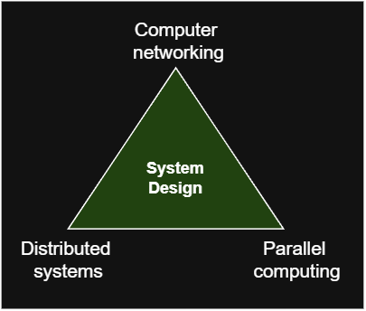
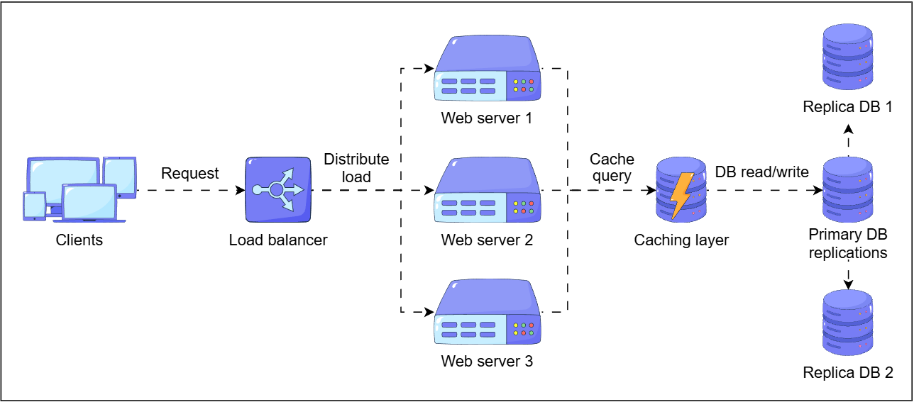
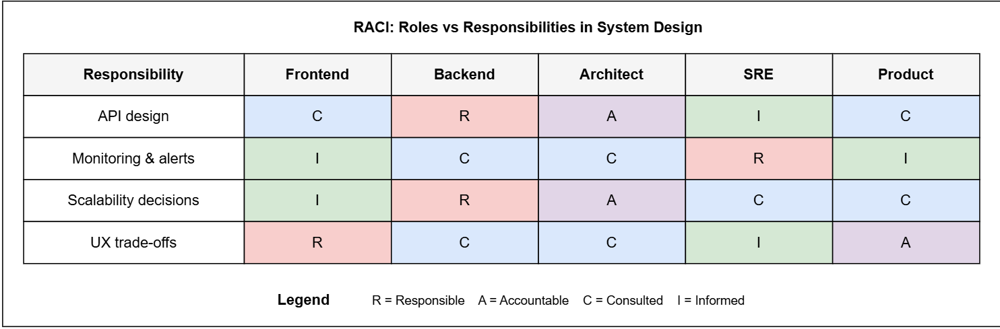
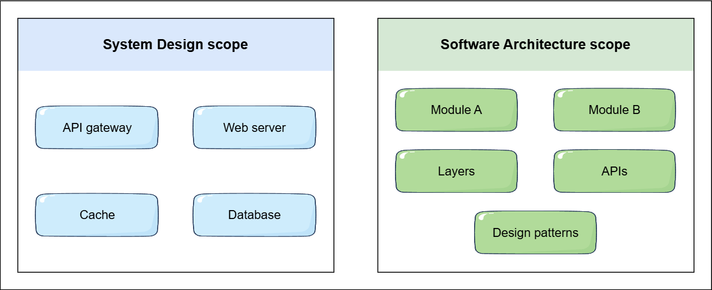
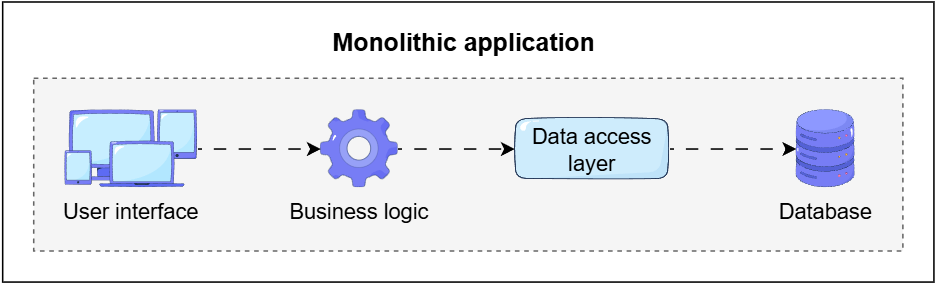
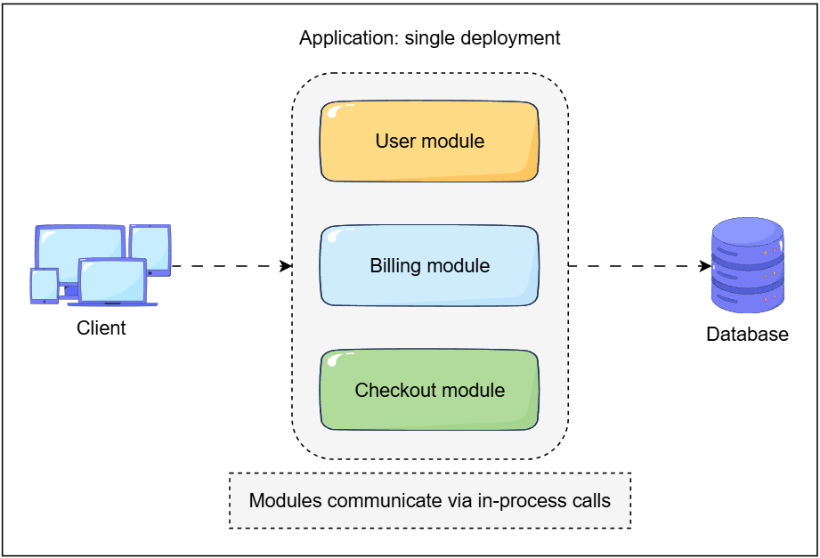
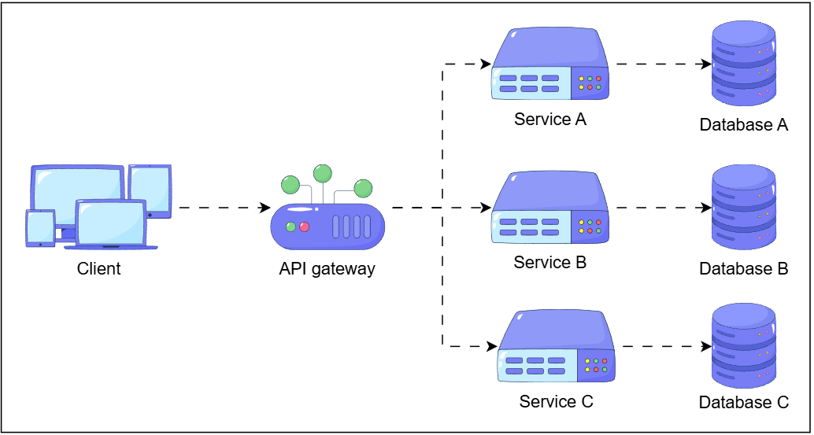

# System Design Fundamentals

> 📖 Notes from: [Grokking System Design Fundamentals – Monolithic vs Microservices]([https://www.educative.io/courses/grokking-system-design-fundamentals/monolithic-vs-microservices-architecture](https://www.educative.io/courses/grokking-system-design-fundamentals))

---

## What is System Design?

**System Design** is the discipline of planning how a software product works end-to-end under real-world conditions. It defines:
- What building blocks the system uses (clients, services, databases, caches, queues, CDNs)
- How those blocks interact (APIs, communication patterns, data flow)
- How the system behaves at scale (traffic spikes, failures, regional outages)
- Which trade-offs to accept (cost vs. reliability, latency vs. consistency)

### Why It Matters

Without a deliberate architectural strategy, a system that works for 1,000 users will likely fail at 1,000,000. Good system design ensures:

| Quality | Definition |
|---|---|
| **Scalability** | Handle massive user loads by distributing requests |
| **Availability** | Remain operational even if some components fail |
| **Low Latency** | Respond to user requests quickly, regardless of location |
| **Consistency** | Reliable and accurate data across the distributed system |

### System Design vs. Code

| Focus Area | Code-Centric | System Design |
|---|---|---|
| **Scope** | Algorithms, classes, functions | Services, APIs, data flows, infrastructure |
| **Typical Tasks** | Writing clean code, unit testing | Defining service boundaries, choosing databases, caching |
| **Failure Modes** | Null pointer exceptions, logic errors | Service outages, cascading failures, latency spikes |
| **Success Metrics** | Code correctness, function performance | System uptime, scalability, reliability |

---

## Common Architectural Pattern

---

## Who Does System Design?

System Design is a collaborative discipline — not owned by a single "architect" role. Every engineering function contributes:

- **Back-end Engineers**: Design APIs, data models, and business logic for specific services
- **Front-end Engineers**: Make decisions around rendering (SSR vs CSR), caching, and API usage
- **System Architects**: Define the end-to-end architecture and select core technologies
- **Site Reliability Engineers (SREs)**: Advocate for monitoring, automated failover, and disaster recovery
- **Product Engineers**: Provide user experience constraints that drive trade-offs (e.g., strong vs. eventual consistency)

---

## System Design vs. Software Architecture

These two terms are related but address different layers:

- **System Design** — the high-level view: hardware, software, networks, and how all components interact at scale
- **Software Architecture** — a subset of System Design focused on the *internal structure* of the software: how code is organized into modules, how they interact, and what patterns are applied

**Example — a photo-sharing app:**

| Software Architecture | System Design |
|---|---|
| How is application code structured? (e.g., layered: API → business logic → data access) | Where will photos be stored? (e.g., Amazon S3 + CDN) |
| How are users authenticated? (e.g., `userService` module with clear interfaces) | How will the system scale to 10M users? (e.g., load balancer + multiple app servers) |
| What language and framework? (e.g., Python/Django) | How to deliver photos globally with low latency? (e.g., CDN) |
| How do modules interact internally? | What databases suit different data types? (SQL for users, NoSQL for metadata) |

> Choosing microservices (a Software Architecture decision) has major System Design implications — it requires service discovery, distributed tracing, and inter-service communication strategies.

---

## Monolithic vs. Microservices Architecture

### 1. Monolithic Architecture

A **monolithic architecture** builds the entire application — UI, business logic, and data access — as a single, indivisible unit.

**Best for:** Early-stage products and small teams.

**Benefits:**
- **Simple development**: Unified codebase in a single repo — easy to set up and test
- **Easy deployment**: Single artifact to deploy
- **Straightforward debugging**: No inter-service communication to trace through

---

### 2. Modular Monolith (Structured Flexibility)

A **modular monolith** stays as one deployable unit but is internally structured into distinct, independent modules — each owning a specific business domain (users, payments, inventory).

**Key rule:** One module should **never** directly query another module's database tables — always go through defined interfaces.

**Advantages over classic monolith:**
- Better codebase organization by domain
- Teams can work on separate modules with less interference
- Modules can be tested in isolation
- Easier to extract a module into a microservice later if needed

> ⚠️ All modules are still deployed together — a failure in one can bring down everything.

---

### 3. Microservices Architecture

In a **microservices architecture**, an application is broken into small, autonomous services. Each runs independently and communicates via APIs over a network.

**Benefits:**
- **Independent deployment**: Teams deploy on their own schedule
- **Technology freedom**: Each service can use the best language/DB for its task
- **Fault isolation**: A failure in one service doesn't crash the whole app
- **Granular scalability**: Scale only the services that need it

**Challenges:**
- Inter-service communication over an unreliable network
- Data consistency across services (eventual consistency patterns needed)
- High operational overhead (monitoring, service discovery, distributed tracing)

> ⚠️ **Common mistake:** Adopting microservices too early. Start with a monolith, identify bottlenecks, then extract services only when you have a real need.

---

### Architecture Comparison

| Feature | Monolith | Modular Monolith | Microservices |
|---|---|---|---|
| **Deployment** | Single unit | Single unit | Multiple independent units |
| **Codebase** | Single, large | Single, logically separated | Multiple smaller codebases |
| **Coupling** | Tightly coupled | Loosely coupled modules | Very loosely coupled services |
| **Scalability** | Scale entire app | Scale entire app | Scale individual services |
| **Operational Complexity** | Low | Low–Medium | High |
| **Team Dynamics** | High coordination needed | Teams own modules; releases coupled | Small autonomous teams |
| **Tech Stack** | Single unified stack | Single unified stack | Polyglot (different stacks per service) |
